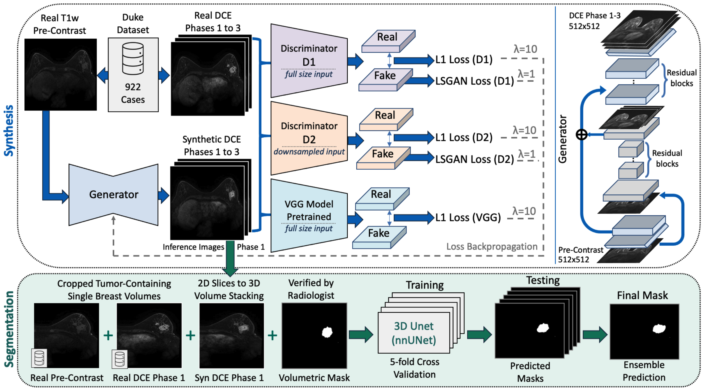

# SimulatingDCE
Official repository of "Simulating Dynamic Tumor Contrast Enhancement in Breast MRI using Conditional Generative Adversarial Networks"




## Getting Started

### Synthesis Code

#### Multi-Sequence Synthesis
- [Code](synthesis/utils/nifti_png_conversion_mpost.py) to extract 2D pngs from 3D NiFti files for the multi-sequence train-val-test split.
- [Code](synthesis/utils/dce_phase_to_channels_conversion.py) to concat multiple DCE-MRI sequences into channels of an image, which is later used as input into the synthesis model.
- [Script](synthesis/pix2pixHD/scripts/train_512p_duke_2D_concat.sh) to run a training of the version of the synthesis model that jointly generates images for corresponding DCE-MRI sequences 1, 2 and 3.
- [Script](synthesis/pix2pixHD/scripts/test_512p_duke_2D_concat.sh) to run a test (inference) of the trained synthesis model that will then jointly generates images for corresponding DCE-MRI sequences 1, 2 and 3 for the test set.
- [Script](synthesis/utils/fid_breast_mri_only_test_GAN_baseline.sh) Compute per DCE-MRI sequence (e.g. 1, 2 and 3) the imagenet and radimagenet-based Frèchet Inception Distances (FIDs) for the GAN generated data.
- [Script](synthesis/utils/metrics_breast_mri_only_test_GAN_baseline.sh) Compute per DCE-MRI sequence (e.g. 1, 2 and 3) the imagenet and radimagenet-based Frèchet Inception Distances (FIDs) for the GAN generated data.
- [Notebook](synthesis/utils/contrast_enhancement_patterns.ipynb) to compute and visualize contrast enhancement kinetic patterns for corresponding multi-sequence DCE-MRI data.

#### Single-Sequence Synthesis
- [Code](synthesis/utils/nifti_png_conversion.py) to extract 2D pngs from 3D NiFti files for the single-sequence train-val-test split.
- [Script](synthesis/pix2pixHD/scripts/train_512p_duke_2D_w_GPU_1to195.sh) to run a training of the image synthesis model.
- [Script](synthesis/pix2pixHD/scripts/test_512p_duke_2D_w_GPU_1to195.sh) to run a test of the image synthesis model.

You may find some examples of synthetic nifti files in [synthesis/examples](synthesis/examples).

#### General
- [Code](synthesis/utils/convert_to_nifti_whole_dataset.py) to transform Duke DICOM files to NiFti files.
- [Code](synthesis/utils/png_nifti_conversion.py) to create 3D NiFti files from axial 2D pngs.
- [Code](synthesis/utils/get_training_patient_ids.py) to separate synthesis training and test cases.
- [Code](synthesis/utils/metrics.py) to compute the image quality metrics such as SSIM, MSE, LPIPS, and more. 
- [Code](synthesis/utils/fid.py) to compute the Frèchet Inception Distance (FID) based on ImageNet and [RadImageNet](https://github.com/BMEII-AI/RadImageNet).  
- The [Duke Dataset](https://sites.duke.edu/mazurowski/resources/breast-cancer-mri-dataset/) used in this study is available on [The Cancer Imaging Archive (TCIA)](https://wiki.cancerimagingarchive.net/pages/viewpage.action?pageId=70226903).

### Segmentation Code
- [Code](nnUNet/custom_scripts/convert_data_to_nnunet_204.py) to prepare 3D single breast cases for nnunet segmentation.
- [Train-test-splits](nnUNet/nnunetv2/nnUNet_preprocessed/Dataset208_DukePreSynthetic/splits_final_pre_post_syn.json) of the segmentation dataset.
- [Script](nnUNet/custom_scripts/full_pipeline.sh) to run the full nnunet pipeline on the Duke dataset.


## Run the model
Model weights are stored on on [Zenodo](https://zenodo.org/records/10210945) and made available via the [medigan](https://github.com/RichardObi/medigan) library.

To create your own post-contrast data, simply run:

```command
pip install medigan
```

```python
# import medigan and initialize Generators
from medigan import Generators
generators = Generators()

# generate 10 samples with model 23 (00023_PIX2PIXHD_BREAST_DCEMRI). 
# Also, auto-install required model dependencies.
generators.generate(model_id='00023_PIX2PIXHD_BREAST_DCEMRI', num_samples=10, install_dependencies=True)
```

## Reference
Please consider citing our work if you found it useful:
```bibtex
@article{osuala2024simulating,
  title={Simulating Dynamic Tumor Contrast Enhancement in Breast MRI using Conditional Generative Adversarial Networks},
  author={Osuala, Richard and Joshi, Smriti and Tsirikoglou, Apostolia and Garrucho, Lidia and Pinaya, Walter HL and Lang, Daniel M and Schnabel, Julia A and Diaz, Oliver and Lekadir, Karim},
  journal={arXiv preprint arXiv:2409.18872},
  year={2024}
}
```

## Acknowledgements
This repository borrows code from the [pre-post-synthesis](https://github.com/RichardObi/pre_post_synthesis), the [pix2pixHD](https://github.com/NVIDIA/pix2pixHD) and the [nnUNet](https://github.com/MIC-DKFZ/nnUNet) repositories. The 254 tumour segmentation masks used in this study were provided by [Caballo et al](https://doi.org/10.1002/jmri.28273).
